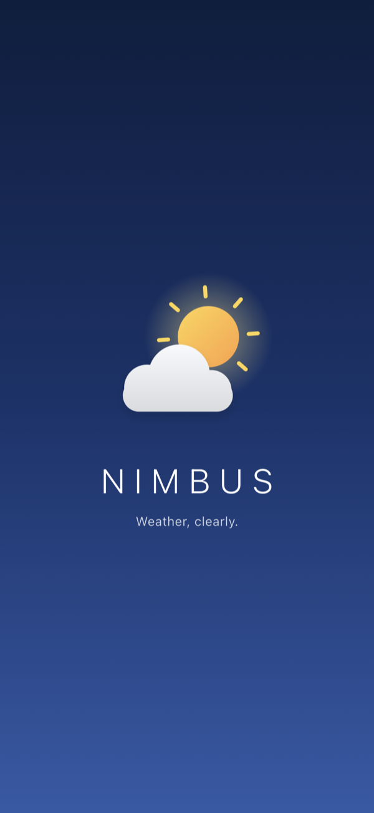
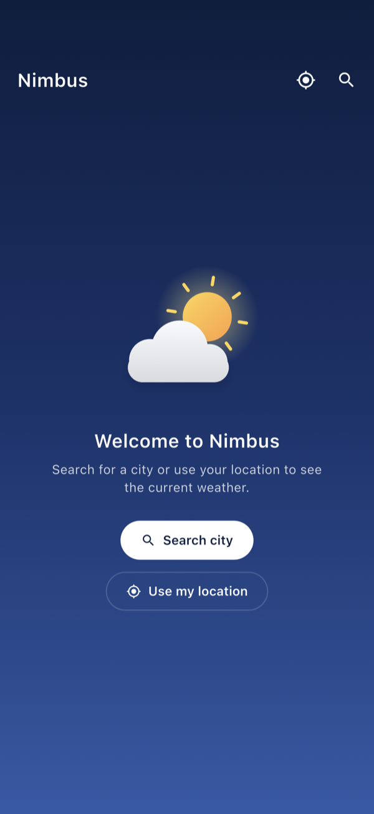
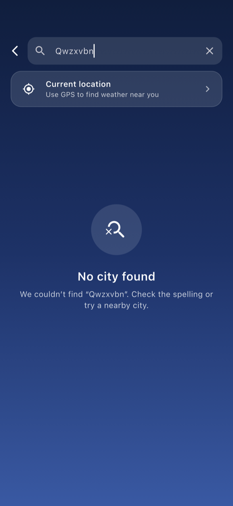
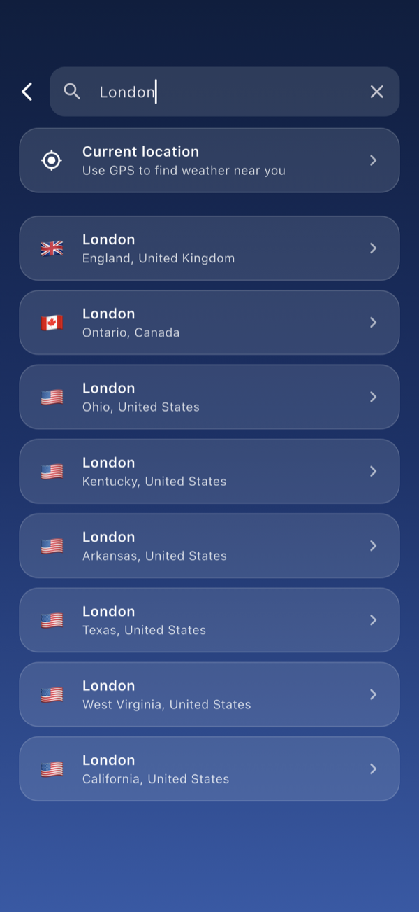
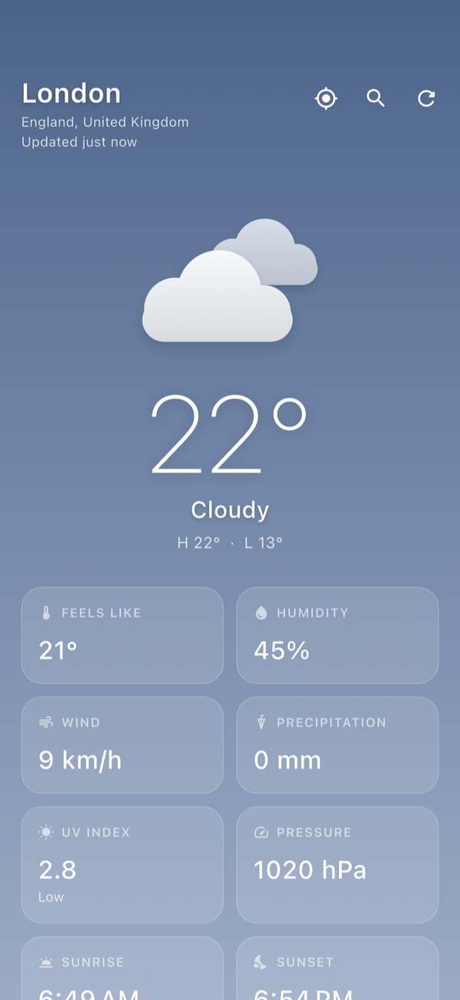
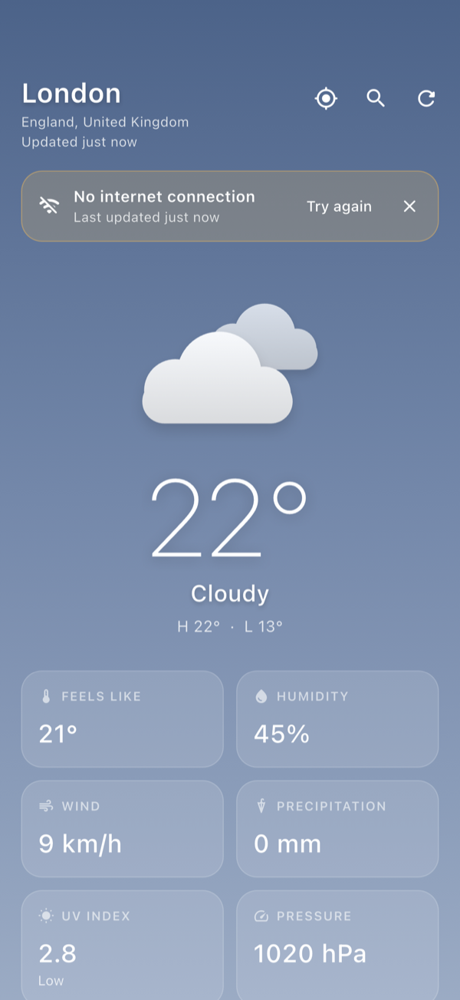
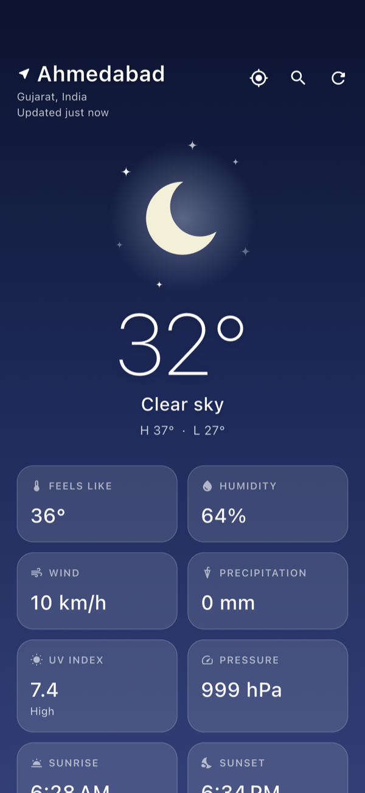
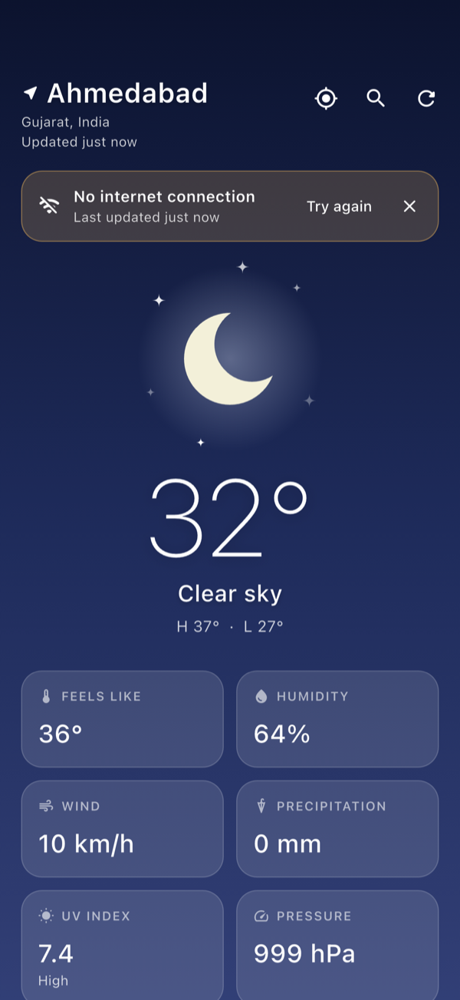

# Nimbus: Flutter Weather App

A Flutter weather app that shows current conditions for any city or for your GPS location. You can refresh on demand, and it keeps showing useful data when the network fails. Built for the Anglara Flutter intern challenge.

| Splash | Welcome | City not found | Search |
|:---:|:---:|:---:|:---:|
|  |  |  |  |

| Weather | Refresh failed (offline) | GPS location | Opened offline (cache) |
|:---:|:---:|:---:|:---:|
|  |  |  |  |

All screenshots are real captures from the iOS simulator against the live API. The [end-to-end test](integration_test/app_walkthrough_test.dart) produced them.

> **Screen recording:** _add the link to the 2–4 minute walkthrough here._

---

## Contents

1. [Features](#features)
2. [Running the project](#running-the-project)
3. [Architecture](#architecture)
4. [State management and the refresh flow](#state-management-and-the-refresh-flow)
5. [Error handling](#error-handling)
6. [Caching and offline behaviour](#caching-and-offline-behaviour)
7. [GPS location](#gps-location)
8. [UI and motion](#ui-and-motion)
9. [Testing](#testing)
10. [Packages](#packages)
11. [Assumptions](#assumptions)
12. [What I'd do next](#what-id-do-next)

---

## Features

**Core**
- [x] **Branded splash screen.** An animated logo, then a circular reveal into the weather screen that grows out of the logo's sun.
- [x] **Weather screen.** Temperature, condition and an animated illustration for that condition. Also today's high and low, feels-like, humidity, wind, precipitation, UV index (with its WHO level), pressure, sunrise and sunset.
- [x] **Manual refresh.** Pull-to-refresh and a refresh button. Both work in every state, including the error view.
- [x] **State handling.** Separate views for first load (skeleton), success, empty and error, plus visible refreshing and refresh-failed states.
- [x] **Location input.** Search-as-you-type, with a debounce and country flags.

**Requirements**
- [x] Free API, [Open-Meteo](https://open-meteo.com). It needs **no API key**.
- [x] Handles invalid city, no internet, timeout, rate limit (HTTP 429), server errors and malformed responses.
- [x] **If a refresh fails, the previous data stays on screen.**
- [x] State management with Cubit (`flutter_bloc`). `setState` is used only for trivial widget-local state such as a ticking clock or a text controller.

**Bonus**
- [x] Local cache of the last successful response. The app opens straight onto it, even offline.
- [x] Device GPS "current location" weather, with full permission handling.
- [x] This README, screenshots, and a test suite of 100 unit and widget tests plus 2 end-to-end tests.

---

## Running the project

**Requirements:** Flutter 3.35 or later (the minimum `shared_preferences` needs; developed and tested on Flutter 3.44 / Dart 3.12), plus Xcode for iOS or the Android SDK for Android.

```bash
git clone <repo-url> nimbus && cd nimbus
flutter pub get
flutter run            # pick an emulator, simulator or device
```

No API keys, `.env` files or code generation are needed.

**Tests**

```bash
flutter test                                   # 100 unit and widget tests, no device needed
flutter test integration_test -d <device-id>   # end-to-end on a device or simulator
```

**Regenerating the screenshots** (iOS simulator):

```bash
xcrun simctl location booted set 23.0225,72.5714                # give the simulator a GPS position
xcrun simctl privacy booted grant location com.nishilsoni.nimbus  # skip the permission prompt
flutter drive --driver=test_driver/integration_test.dart \
  --target=integration_test/app_walkthrough_test.dart -d <simulator-id>
```

Screenshots are written to `docs/screenshots/`. The `privacy grant` command only works once the app is installed, so run the app once first.

---

## Architecture

The app follows a lightweight **Clean Architecture**. Folders are grouped **by feature first, then by layer**. Dependencies only point inwards:

```
┌────────────────────────────────────────────────────────────┐
│ Presentation   screens · widgets · cubits · states          │
│                knows: domain                                 │
├────────────────────────────────────────────────────────────┤
│ Domain         entities · repository interfaces              │
│                knows: nothing (pure Dart, no Flutter/HTTP)   │
├────────────────────────────────────────────────────────────┤
│ Data           repository impls · data sources · models      │
│                knows: domain, HTTP, storage, plugins         │
└────────────────────────────────────────────────────────────┘
          app/dependencies.dart wires them together
```

**Rules the code follows**
- **Widgets never see HTTP, JSON or storage.** They receive plain entities and callbacks. Screens are the only widgets that talk to a cubit.
- **Cubits depend on repository *interfaces***, so they're tested with mocks. They never catch exceptions: repositories return a `Result` (`Ok` or `Err`).
- **Exceptions stop at the repository.** Transport problems become typed `AppException`s in `ApiClient`, and the repository turns them into `Failure`s that the UI knows how to show.
- **Models (DTOs) and entities are separate.** `WeatherModel` knows Open-Meteo's JSON shape and WMO codes. `Weather` is what the app reasons about.
- **One composition root.** [`app/dependencies.dart`](lib/app/dependencies.dart) is the only file that names concrete classes. Plain constructor injection is enough at this size and reads top to bottom. There is no service locator.

### Folder structure

```
lib/
├── main.dart                     Bootstraps: build dependencies, runApp
├── app/
│   ├── app.dart                  MaterialApp, theme, providers
│   └── dependencies.dart         Composition root (the only place concrete classes are named)
├── core/                         Shared by every feature, depends on no feature
│   ├── constants/                API endpoints and fields; every user-facing string
│   ├── error/                    AppException (data layer) and sealed Failure (domain)
│   ├── network/                  ApiClient (timeout, status → exception); NetworkInfo
│   ├── navigation/               CircularRevealRoute page transition
│   ├── theme/                    Colours, text styles, ThemeData
│   ├── utils/                    Result type, JSON reader, date/unit formatters, flags
│   └── widgets/                  GlassCard, StatusMessage, skeletons, SkyShapes painters…
└── features/
    ├── splash/presentation/      Splash screen and animated logo
    └── weather/
        ├── domain/
        │   ├── entities/         City, Weather, WeatherReport, WeatherCondition
        │   └── repositories/     WeatherRepository, LocationRepository (interfaces)
        ├── data/
        │   ├── datasources/      Open-Meteo forecast and geocoding, local cache, device GPS
        │   ├── models/           JSON ↔ entity mapping
        │   ├── mappers/          WMO weather code → WeatherCondition
        │   └── repositories/     Implementations: exception → Failure, caching
        └── presentation/
            ├── cubit/            WeatherCubit, CitySearchCubit and their states
            ├── screens/          WeatherScreen, CitySearchScreen
            ├── utils/            How each Failure and condition is shown (icon, copy, sky)
            └── widgets/          Header, hero conditions, detail grid, banner, views…
```

A few placement decisions worth calling out:
- **`SkyShapes` lives in `core/widgets`** because the splash logo and the weather illustrations both draw with it. Keeping it in the weather feature would make splash depend on weather.
- **The WMO code → condition mapping lives in the data layer.** Codes are a detail of the provider. The domain only knows `WeatherCondition`.
- **Failure icons and copy live in `presentation/utils/failure_display.dart`**, not on the `Failure` classes, so the domain stays free of Flutter.

---

## State management and the refresh flow

**Why Cubit:** the weather screen is a small state machine driven by method calls (select city, refresh, use location). Cubit models that with plain methods and immutable states, with none of the event boilerplate a full Bloc would add. `bloc_test` makes every transition easy to assert.

### `WeatherState`

A common mistake is a single `loading | success | error` enum, because an error then throws away the data on screen. Here **the data and the request status are separate fields**:

```dart
final class WeatherState {
  final WeatherStatus status;    // initial | loading | success | failure (the full-screen view)
  final WeatherReport? report;   // last good data; only a successful fetch replaces it
  final Failure? failure;        // why the latest request failed
  final bool isRefreshing;       // a request is running while data is on screen
  final bool isFromCache;        // report came from storage, not yet confirmed live
}
```

| Situation | What the user sees |
|---|---|
| First launch, nothing cached | Welcome view with **Search city** and **Use my location** |
| First load running | Skeleton in the same layout as the real content |
| First load failed | Full-screen error with the right action (Try again / Open settings) and a Search fallback |
| Data loaded | Weather content |
| Refreshing | Content stays. Thin progress bar, a spinner in the refresh button (disabled), and the pull-to-refresh indicator |
| **Refresh failed** | **Content stays.** A banner shows the reason, how old the data is ("Last updated 5 min ago"), and Retry and Dismiss buttons |
| Opened offline with a cache | Cached weather straight away, then the same banner once the live refresh fails |
| Switched city while offline | The previous city stays on screen, and the banner explains why the switch didn't happen |

### Three rules in `WeatherCubit`

These are where refresh logic usually breaks, so each one has its own test:

1. **Data is only replaced by newer successful data.** A failure with data on screen only sets `failure`. Without data, it becomes the full-screen error.
2. **The latest request wins.** Every request gets a serial number. If the user picks Paris while a London request is still running, the London response is ignored when it arrives.
3. **A refresh joins a running request instead of duplicating it.** A double tap, or a pull while a button refresh is running, returns the same `Future`. The API is called once, and the pull-to-refresh spinner stays up until that request finishes.

`refresh()` also works when there's no data yet. It repeats the user's last request, so **Try again** after a denied location permission asks for the location again rather than doing nothing.

### How a refresh flows through the layers

```
User pulls down
  → WeatherScreen            RefreshIndicator.onRefresh → cubit.refresh()
  → WeatherCubit             emit(isRefreshing: true), clear old failure
  → WeatherRepositoryImpl    getWeather(city)
      → WeatherRemoteDataSource → ApiClient.getJson(uri)
          offline?        → NoInternetException
          > 10 s?         → RequestTimeoutException
          HTTP 429?       → RateLimitException
          other non-2xx   → ServerException
          bad JSON shape  → ParsingException
      ← WeatherModel → saved to cache → Ok(WeatherReport)
      ← or AppException → Err(Failure)
  → WeatherCubit             Ok: replace report   Err: keep report, set failure
  → WeatherScreen            rebuilds: new data, or the same data plus a banner
```

`CitySearchCubit` uses the same ideas. Typing is **debounced (400 ms)**, which also helps avoid the rate limit. Results that arrive after the query changed are dropped. Previous results stay visible while the next search loads.

---

## Error handling

`Failure` is a **sealed class**. Every `switch` over it is exhaustive, so a new failure type won't compile until the UI gives it an icon, a title, a message and an action.

| Failure | Detected in | User sees | Action |
|---|---|---|---|
| `NoInternetFailure` | `NetworkInfo` pre-check; `SocketException` / `ClientException` | "No internet connection" | Try again |
| `TimeoutFailure` | `ApiClient` (10 s timeout) | "Request timed out" | Try again |
| `RateLimitFailure` | HTTP 429 | "Too many requests" | Try again |
| `CityNotFoundFailure` | Geocoding returned no results | "We couldn't find 'xyz'…" | (retrying won't help, so no button) |
| `ServerFailure` | Other non-2xx status | "Weather service unavailable" | Try again |
| `LocationFailure` | GPS service off / permission denied / blocked / no fix | A specific message for each case | Open settings, or Try again |
| `UnknownFailure` | Malformed JSON, anything unexpected | "Something went wrong" | Try again |

Details that are easy to miss:
- Responses are decoded as **UTF-8 explicitly**. Otherwise `http` falls back to Latin-1 when the charset header is missing, and names like "Zürich" come out garbled.
- A **failed cache write never fails a successful fetch.**
- JSON parsing goes through a small [`JsonReader`](lib/core/utils/json_reader.dart) whose errors name the bad field. If the API changes, you get one clear error instead of a random `TypeError`.
- A **corrupt cache entry is deleted** instead of crashing the app on launch.

---

## Caching and offline behaviour

- After every successful fetch, the city, the API response and the fetch time are saved to `shared_preferences`. Only one small record is kept, so a database would be overkill.
- The cache stores the response **in the API's own JSON shape**, so one parser reads both live and cached data (and there's a round-trip test).
- On launch, the cubit starts reading the cache **while the splash animates**. The weather screen usually opens on data straight away, then refreshes live in the background.
- The app also reopens on the last city that loaded successfully.

---

## GPS location

The **Use my location** buttons (in the header, on the welcome view and on the search screen) run this sequence:

1. Is location enabled on the device? If not, show "Location is turned off" with an **Open settings** button that opens the device's location settings.
2. Check the permission and ask if needed. Denied → **Try again**. Permanently denied → **Open settings** (app settings).
3. Get a fix at city-level accuracy, with a 15 s time limit. City-level is all weather needs, and it's faster and uses less battery.
4. Reverse-geocode to a place name. If that fails, the coordinates become the label. The weather still loads either way.

The plugins are wrapped in `DeviceLocationDataSource`. Their static methods can't be mocked, and the wrapper lets the permission logic be unit-tested (8 tests).

Platform setup is already done: `ACCESS_COARSE_LOCATION` and `ACCESS_FINE_LOCATION` are declared on Android, and `NSLocationWhenInUseUsageDescription` on iOS.

---

## UI and motion

- **Every illustration is painted in code** (`CustomPainter`): a turning sun, a crescent moon with twinkling stars, drifting clouds, and falling rain, snow, lightning and fog. There are no image assets or icon packs, and the drawing is sharp at any size. Each animation completes a whole number of cycles per loop, so it never jumps when the loop restarts.
- The **background gradient** follows the condition and whether it's day or night, and animates between skies.
- **Splash:** the sun rises and the cloud drifts in, the wordmark fades up, then a **circular reveal** grows from the sun's centre into the weather screen. The native launch screen uses the same navy on Android (including the Android 12+ splash API) and iOS, so there's no white flash before Flutter draws.
- **Reduced motion:** when the OS "reduce motion" setting is on, the illustrations and skeleton hold still and the splash is shorter.
- **Accessibility:** tooltips on every icon button, a merged semantics label for the hero temperature and condition, and a live region on the refresh banner.

---

## Testing

```
test/
├── core/network/api_client_test.dart          offline, socket, timeout, 429, 4xx/5xx, bad JSON, UTF-8
├── core/utils/formatters_test.dart            relative time, units, UV levels, flags
└── features/weather/
    ├── data/…/wmo_code_mapper_test.dart       every WMO code group
    ├── data/…/models_test.dart                real API fixtures, cache round trips, missing fields
    ├── data/…/weather_local_data_source_test  save and read, corrupt entry recovery
    ├── data/…/weather_repository_impl_test    exception → Failure, caching, not-found
    ├── data/…/location_repository_impl_test   every permission path, geocoding fallback
    ├── presentation/cubit/weather_cubit_test  the refresh rules, cache-first launch, GPS
    ├── presentation/cubit/city_search_cubit…  debounce, not found, stale results
    └── presentation/screens/weather_screen…   each state renders; buttons call the cubit
integration_test/app_walkthrough_test.dart     live API end to end (also takes the screenshots)
```

The fixtures in `test/fixtures/` are real Open-Meteo responses captured during development.

---

## Packages

The list is deliberately short. Each package does one job that would be unreasonable to rewrite:

| Package | Why |
|---|---|
| `flutter_bloc` | Cubit state management |
| `equatable` | Value equality for states and entities |
| `http` | HTTP client. Error mapping, timeouts and decoding are hand-written in `ApiClient` |
| `connectivity_plus` | Fast offline pre-check |
| `shared_preferences` | Stores the last report |
| `geolocator` | GPS position and permissions |
| `geocoding` | Coordinates → place name (Open-Meteo has no reverse geocoding) |
| `intl` | Time and date formatting |
| `bloc_test`, `mocktail` | Testing cubits and mocking repositories |

---

## Assumptions

- **Open-Meteo** was chosen so reviewers can run the app without an API key. Its free tier allows about 10,000 calls a day.
- **Metric units** (°C, km/h, mm, hPa).
- **One active location at a time.** The last one that loaded successfully is remembered.
- **The cache keeps only the last successful report.**
- **Scope is current weather plus today's high and low.** Multi-day forecasts were out of scope.
- **Refreshing a GPS-based report re-fetches weather for the same coordinates.** It doesn't take a new GPS fix, which keeps refresh fast. Tapping **Use my location** again takes a new fix.
- The **offline check is a fast pre-check only**. Being on Wi-Fi with no internet is caught when the request itself fails.
- **Targets Android and iOS.** Web and desktop weren't targeted, and GPS needs a device or an emulator with a location set.

---

## What I'd do next

- A 7-day forecast and an hourly chart (the API already supports them).
- A °C / °F setting and localisation (all copy is already in `AppStrings`).
- Several saved cities with swipe navigation.
- Golden tests for the painted illustrations.
